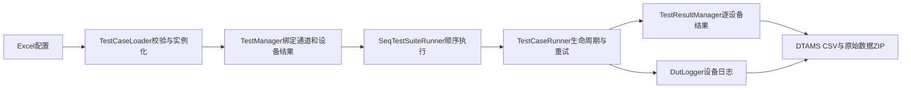

# 项目梳理与修复记录

审查日期：2026-09-29。审查范围包含全部 Python 源码、两个配置文件、历史运行日志、现有虚拟环境以及从干净环境安装运行。

## 主流程



| 模块 | 职责 |
| --- | --- |
| main.py、__main__.py | 配置参数、等待执行结束、打印结果、报告导出、退出码 |
| manage.py | 配置、通道加载、共享数据绑定、结果管理器绑定与资源关闭 |
| loader.py、config.py | Excel读取、配置校验、默认值、动态类加载 |
| testcase.py、testsuite.py | 生命周期接口、状态、取消信号、套件与计时 |
| runner.py | 异步执行、重试、停止、超时、状态回调和后台异常传递 |
| testresult.py | 逐设备结果、SN索引、汇总与报告生成 |
| logger.py、dtams.py | 日志隔离、跨日轮转、结构化CSV |
| testcases.py | 加减法演示用例，不包含真实设备驱动 |

## 已复现和修复的问题

| 问题 | 原行为 | 修复后的行为 |
| --- | --- | --- |
| 普通用例不执行 | 执行代码错误缩进在 `FailSkipFlag==1` 分支下，示例两个项目均为 PAUSE | 所有启用用例正常执行，仅满足跳过条件时跳过 |
| 计时接口缺失与错位 | 调用不存在的 `add_case_time`；跳过后无法按项目索引查耗时 | 按用例索引记录，跳过/未执行项为0，重跑清空 |
| 状态回调失真 | 每次循环就切回IDLE，异常/停止路径又可能不恢复 | 整轮进入RUNNING，最终统一恢复IDLE，回调异常写日志 |
| 示例减法状态字段错误 | 写入 `TestStatus` 而执行器读取 `Status`，失败不触发重试 | 写入统一字段并保存-4测量值，按配置完成三次尝试 |
| 异常处理再次崩溃 | 调用不存在的 `splitline()` | 测试错误变为FAIL；原始异常和清理异常保留在明细 |
| 生命周期错误 | 准备失败后继续执行测试 | 不再执行测试，仍尝试清理 |
| 超时清理和残留线程 | 对普通线程调用 `terminate()`；吞掉SystemExit；清理可能与原线程并发 | 同一工作线程负责清理，限时等待；残留线程阻止重试、后续执行、重启与导出 |
| 超时后迟到的PASS | 后续清理代码可能覆盖已发布失败结果 | 清理结束后重新确认取消失败状态 |
| 重试串用状态 | 重用旧用例、异常、测量值和设备结果；空业务异常被漏判 | 每次尝试重置；任一设备失败驱动重试；空业务异常仍判FAIL |
| 重复启动/后台失败不可见 | 同一套件可并发重复启动，线程报错后调用方不知情 | 重复启动明确拒绝，`wait()`传递后台框架异常 |
| Excel配置失效 | 空白单元格变NaN、缺少字段/空表出错、错误累积、配置路径共享 | 默认值、类型和列校验、错误重置、加载器状态隔离 |
| 全局配置错误被忽略 | 非法JSON仅写日志继续运行，版本号被硬编码覆盖 | 非法配置阻止加载，版本号保留，通道报告元数据独立 |
| 通道加载破坏原状态 | 先替换套件/执行器，再检查错误；负索引可选中末通道 | 完整加载成功后才替换；运行期间及越界请求拒绝 |
| SN及结果索引不一致 | 重复SN校验前已修改设备，旧映射残留，越界更新静默丢失 | 原子更新映射，拒绝负索引/越界和未知项目 |
| 多设备日志互相干扰 | 每创建设备日志都调用全局dictConfig，关闭其他日志处理器 | 独立日志对象和处理器，按运行创建、显式关闭 |
| 跨日日志路径错误 | Windows字符串拼接、日期与重复路径混用 | pathlib目录处理，更新日期目录与锁文件路径 |
| 报告导出崩溃 | 引用不存在的 `logger_dic` | 根据设备精确引用日志，导出前flush，导出后仍可使用 |
| CSV表头错误 | dict_keys/dict_values作为单元格写入 | 表头和值分别按字段展开，明细列与表头对齐 |
| 报告文件冲突/不兼容 | 时间含冒号、秒级文件名重叠、序列号含路径符号 | 安全文件名、微秒时间、通道/设备索引，临时目录中构建后发布 |
| 安装与入口无法复现 | 没有依赖声明，入口固定sleep一秒即读结果 | 包元数据/依赖/命令行入口，等待实际结束并提供退出码 |

## 配置实际状态

- `config.xlsx`：0字节空文件，加载时明确提示空配置。
- `config1.xlsx/global`：1个通道、每通道1台设备，有合法GlobalConfig。
- `config1.xlsx/debug`：加法1+5通过；减法1-5失败，重试次数3、间隔3秒。这是演示逻辑的预期结果。
- `config1.xlsx/prod`：空工作表，缺少生产用例。保留原文件，不能将演示用例当作真实生产测试。

## 验证

```bash
.venv/bin/python -m unittest discover -v
.venv/bin/python -m compileall -q davincitest tests
.venv/bin/python -m davincitest --sn DEMO001 --report-dir reports
```

回归测试覆盖：正常生命周期、准备/执行/清理异常、空业务异常、重试恢复、设备结果驱动状态、未上报结果、失败跳过/停止、超时与残留线程、停止准备/重试等待、重复启动/重复运行、后台异常、配置校验/回滚/加载器隔离、SN映射、负索引、CSV/日志/ZIP归档、重复报告、跨日日志、多通道并发和命令行退出码。

本次44个回归测试全部通过，源码编译检查通过。原虚拟环境使用 pandas 2.3.0 / concurrent-log-handler 0.9.28；干净环境使用 pandas 2.3.3 / concurrent-log-handler 0.9.29，均使用 Python 3.10.11。

在独立临时虚拟环境中从本项目构建并安装包，再从项目目录之外执行安装后的入口，验证默认配置文件随包分发以及相对路径不影响启动。

## 验证边界

当前项目提供的是框架与算术演示，没有真实仪器、DUT通信、工站UI或远程DTAMS上传实现。此次验证覆盖软件流程与模拟阻塞/异常；真实设备I/O、工站配置以及外部系统导入仍需现场验证。CSV沿用GBK，外部DTAMS端未连接验证。

线程终止无法保证立即打断底层阻塞I/O。框架会显式停止后续操作并报告遗留清理，设备用例仍应设置通信超时与响应取消信号。对于必须提供强隔离的硬件流程，可以后续另行设计进程执行模式。
